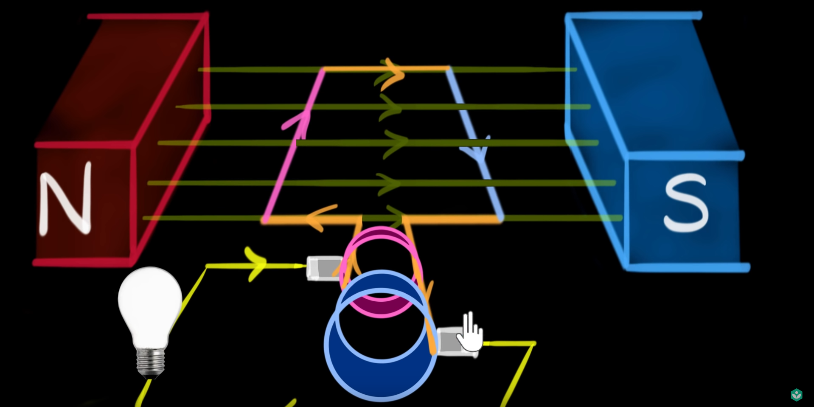

To zakres materiału na sprawdzian 17 wrzesnia.
Treści nauczania – wymagania szczegółowe
1. Prąd stały. Uczeń:
   1. [ ] wyjaśnia pojęcie siły elektromotorycznej ogniwa i oporu wewnętrznego;  
      **Siła elektromotoryczna** - przyczyna powodująca przepływ ładunków elektrycznych.
      $$
        \epsilon = IR = I(R + r_{z}) \rArr I = \frac{\epsilon}{R + r_{z}}
      $$
      gdzie $r_{z}$ jest oporem wewnętrznym źródła.
   2. [ ] oblicza opór przewodnika, znając jego opór właściwy i wymiary geometryczne;  
      Niech $R$ będzie oporem przewodnika, $l$ jego długością, $S$ powierzchnią jego przekroju (st.: $l \perp S$), a $\rho$ oporem właściwym, charakterystycznym dla każdego materiału
      $$
        R = \rho\frac{l}{S}
      $$
   3. [ ] rysuje charakterystykę prądowo-napięciową opornika podlegającego prawu Ohma;  
      $$
      U = IR
      $$
      ¡$R$ opisuje przewodnik, a $U$ i $I$ układ!  
      
   4. [ ] stosuje prawa dwa Kirchhoffa do analizy obwodów elektrycznych;  
      Pierwsze prawo: sum of input currents is equal to the sum of leaving currents.
      $$
      \sum_{i}^{n_{in}} I_i = \sum_{i}^{n_{out}} I_i
      $$
      Drugie prawo: suma napięć równa jest sumie sił elektromotorycznych w obwodzie (sumy algebraiczne).
      $$
      \sum_{i}^{n} \epsilon_{i} = \sum_{i}^{m} U_{i}
      $$
   5. [ ] oblicza opór zastępczy oporników połączonych szeregowo i równolegle;  
      Szeregowo (linear): $R = \sum_{i}^{n} R_i$  
      Równolegle (parallel): $\frac{1}{R} = \sum_{i}^{n} \frac{1}{R_i}$
   6. [ ] oblicza pracę wykonaną podczas przepływu prądu przez różne elementy obwodu oraz moc rozproszoną na oporze;  
      $$
      P = UI = I^2R = \frac{U^2}{R} \\
      W = Pt  \\
      \rArr W = UIt = I^2Rt = \frac{U^2}{R}t
      $$
   7. [ ] opisuje wpływ temperatury na opór metali i półprzewodników.  
      Assuming that $\frac{d\alpha}{dT} \approxeq 0$
      $$
      \frac{dR}{R} = \alpha dT \\
      \int_{R_0}^{R(T)} \frac{1}{R} dR = \int_{T_0}^{T} \alpha dT \\
      \ln(R) \Bigg\vert_{R_0}^{R(T)} = \alpha\Delta{T} \\
      R(T) = R_0e^{\alpha\Delta{T}}
      $$
      Then, by applying Taylor Series approximation at the first order around $T_0$, we get:
      $$
      R(T) = R_0[1 + \alpha(T - T_0)]
      $$
2. Magnetyzm, indukcja magnetyczna. Uczeń:
   1. [ ] szkicuje przebieg linii pola magnetycznego w pobliżu magnesów trwałych i przewodników z prądem (przewodnik liniowy, pętla, zwojnica);  
      
      
      
   2. [ ] oblicza wektor indukcji magnetycznej wytworzonej przez przewodniki z prądem (przewodnik liniowy, pętla, zwojnica);  
      Niech $H$ będzie natężeniem pola magnetycznego,  
      $B$ wektorem jego indukcji,  
      $I$ natężeniem prądu w przewodniku,  
      $\mu_0$ przenikliwością magnetyczną próżni ($\bold{\mu_0 = 4\pi \times 10^-7 \frac{H}{m}}$ where $H = \frac{kg\cdot m^2}{s^2A^2}$),  
      a $\mu$ przenikliwością mag. przewodnika  
      We wszystkich równaniach:
      $$
      B = \mu\mu_0H
      $$  
      1. Przewodnik liniowy   
         $r$ - odległość od przewodnika **liniowego**
         $$
         H = \frac{I}{2\pi r} \rArr B = \frac{I\mu_0\mu}{2\pi r}
         $$
      2. Pętla  
         $R$ - promień pętli  
         $$
         H = \frac{I}{2R} \rArr B = \frac{I\mu_0\mu}{2R}
         $$
      3. A coil  
         $l$ - długość zwojnicy  
         $n$ - liczba zwojów  
         $$
         H = \frac{nI}{l} \rArr B = \frac{nI\mu_0\mu}{l}
         $$
   3. [ ] analizuje ruch cząstki naładowanej w stałym jednorodnym polu magnetycznym;
      $$
      F_L = q\vec{v}\times\vec{B}\\
      F_L = qBv\sin(\theta[\vec{v}, \vec{B}])\\
      v = \omega r = \frac{2\pi}{T}r\\ 
      F_d = F_L \rArr \frac{v^2m}{r}=qBv \rArr \frac{2\pi}{T} = \frac{qB}{m} \rArr T = \frac{2\pi m}{qB}\\
      r = \frac{mv}{qB}
      $$
      Kierunki można uzyskać z reguły prawej dłoni:  
      $(thumb, index, middle) = (F, B, v)$

   4. [ ] opisuje wpływ materiałów na pole magnetyczne;  
      $m$ - przenikalność magnetyczna (względna)
      $B_0$ - indukcja bez rdzenia
      $$
      B = m B_0
      $$
      Materiały dzielą się na 3(/4) grupy ze względu na przenikalność magnetyczną:
      1. Diamagnetyki     : $m \lt 1$
      2. Paramagnetyki    : $m \lesssim 1$
      3. Ferromagnetyki   : $m \gg 1$
      4. *Nadprzewodniki* : $m = 0$
   5. [ ] opisuje zastosowanie materiałów ferromagnetycznych;  
      Ferromagnetyki to materiały, które mogą stać się stałymi magnesami. Wykorzystywane są np. w generatorach, transformatorach, czy też głośnikach.
   6. [ ] analizuje siłę elektrodynamiczną działającą na przewodnik z prądem w polu magnetycznym;  
      
   7. [ ] opisuje zasadę działania silnika elektrycznego;
        
      Działanie: na wirnik oddziałują siły **elektro magnetyczne** ($F_M = \sum_{i} F_{Li} = l\vec{I}\times\vec{B} = lIB\sin(\vec{I}, \vec{B})$ gdzie l jest długością boku wirnika), które generują Torque ($\tau = F_MR$ gdzie $R$ to połowa odległości między ramionami wirnika). Następnie, dzięki **komutatorom**, kierunek przepływu prądu się zmienia i wirnik kontynuuje obrót (inaczej by machał z jednej w drugą). (Szczotki dostarczają prąd do wirnika)
   8. [ ] oblicza strumień indukcji magnetycznej przez powierzchnię;  
      $\vec{S}$ - vector normalnej do powierzchni o polu $S$
      $$
      \phi = \vec{B}\cdot\vec{S} = BS\cos(\vec{B}, \vec{S})
      $$
   9. [ ] analizuje napięcie uzyskiwane na końcach przewodnika podczas jego ruchu w polu magnetycznym;
      $$
      \epsilon = -\frac{\partial\phi}{\partial t} = -\frac{B\sin(\theta)\partial S}{\partial t} = -\frac{Bl\sin(\theta)\partial x}{\partial t} = -Blv\sin(\theta)
      $$
      $\theta$ - kąt między $I$ i $B$
   10. [ ] oblicza siłę elektromotoryczną powstającą w wyniku zjawiska indukcji elektromagnetycznej;  
      EMF for a coil:  
      $n$ - liczba zwojów  
      $L$ - indukcyjność zwojnicy
      $$
      \epsilon = -\frac{n\partial \phi}{\partial t} = -\frac{nS\partial B}{\partial t} = -\frac{nS\mu\mu_0\partial H}{\partial t} =  -\frac{nS\mu\mu_0\frac{n}{l}\partial I}{\partial t} \\
      L = \frac{n^2\mu\mu_0S}{l} \rArr \epsilon = -L\frac{\partial I}{\partial t}
      $$
   11. [ ] stosuje regułę Lenza w celu wskazania kierunku przepływu prądu indukcyjnego;
      
      Przy zbliżaniu magnesu do przewodu (pętli), generuje się pole magnetyczne, które utrudnia jego przybliżanie, natomiast w drugą stronę, utrudnia jego wyciąganie. Słowem: skurwesyn.
      Dzieje się tak, ponieważ zmieniające się pole magnetyczne indukuje siłę elektromotoryczną, przez którą płynie prąd, a dzięki temu powstaje pole magnetyczne.
   12. [ ] opisuje budowę i zasadę działania prądnicy i transformatora;   
         1. Prądnica:  
         As the wire-frame rotates in the magnetic field, an EMF in induced, thus generating a current. Each arm of the wire-frame is connected to only one *slip ring*, which are in turn connected to carbon brushes. The direction of the current changes when the wire-frame is in a vertical position (because, from the right hand rule, if the force acts 'upwards,' the current in induced into the screen and vv.)  
         $\epsilon_0$ - amplituda pr. zmiennego  
         $n$ - liczba ramek  
         
         $$
         \epsilon_0 = nBS\omega\\
         \epsilon_{\text{ind}} = \epsilon_0\sin(\omega t)
         $$
           
         1.  Transformator  
         Varying current in the input coil creates a varying magnetic flux in the core, which then induces an EMF in the second coil, which then induces a current in the output coil.  
         
         $$
         P_P = P_S \rArr U_PI_P = U_SI_S \rArr \frac{U_P}{U_S} = \frac{I_S}{I_P} = \frac{n_P}{n_s} = p^{-1} \\
         \text{przekładnia transformatora} \\
         p = \frac{n_S}{n_P}
         $$
   13. [ ] opisuje prąd przemienny (natężenie, napięcie, częstotliwość, wartości skuteczne);  
      $Z$ - zawada (taki opór, ale AC)  
      $R_L$ - la resistancia del rollo  
      $R_C$ - la resistancia del capacitor  
      $\phi$ - phase shift  
      $X_S$ - $X$ skuteczne
      $$
      \begin{aligned}
         \cos\phi=\frac{R}{Z} && \tan\phi = \frac{R_L-R_C}{R}
      \end{aligned}
       \\
      \phi = 
      \begin{cases}
         R_L > R_C &:&\phi > 0 \\
         \text{otherwise} &:& \phi < 0
      \end{cases}\\
      $$
      $$
      Z = \sqrt{R^2+(R_C-R_L)^2} \\
      R_C = \frac{1}{\omega C} \\
      R_L = \omega L \\
      $$
      $$
      P_S = U_SI_S\cos\phi \\
      I = I_0\sin(\omega t) \\
      U = U_0\sin(\omega t + \phi)
      $$
      $$
      \begin{aligned}
         W_{AC} = \frac{1}{2}I_0^2Rt &&,&& W_{DC} = I_{sk}^2Rt && \rArr I_{sk}=\frac{I_o}{\sqrt{2}}
      \end{aligned}\\
      \begin{aligned}
         W_{AC} = \frac{U^2t}{2R} &&,&& W_{DC} = \frac{U^2t}{R} && \rArr U_{sk}=\frac{U_o}{\sqrt{2}}
      \end{aligned}\\
      $$
      ### Energies
      Magnetic - coil: $E_m = \frac{1}{2}LI^2$  
      Electric - capacitor: $E_C = \frac{1}{2}\frac{1}{C}Q^2$
      $$E_m + E_C = \text{const}$$
      
   14. [ ] opisuje zjawisko samoindukcji;   
      Indukcja wywołana w przewodzie przez płynący w niej prąd. Indukuje EMF, który sprzeciwia się zmianą natężenia prądu (zgodnie z prawem Lenza).  
      Bez zjawiska samoindukcji:  
      $$
      I = \frac{\epsilon}{R_{\text{total}}}
      $$  
      Uwzględniając samoindukcję, otrzymujemy:  
      $$
      I = \frac{\epsilon-\epsilon_{ind}}{R_{\text{total}}}
      $$
      _inductance.jpeg)  

   15. [ ] opisuje działanie diody jako prostownika.
      
3.  Wymagania przekrojowe. Oprócz wiedzy z wybranych działów fizyki, uczeń:
    1. [ ] przedstawia jednostki wielkości fizycznych wymienionych w podstawie programowej, opisuje ich związki z jednostkami podstawowymi;
    2. [ ] samodzielnie wykonuje poprawne wykresy (właściwe oznaczenie i opis osi, wybór skali, oznaczenie niepewności punktów pomiarowych);
    3. [ ] przeprowadza złożone obliczenia liczbowe, posługując się kalkulatorem;
4. Wymagania doświadczalne
Uczeń przeprowadza obserwacje/doświadczenia:
   1. [ ] Badanie kształtu linii pól magnetycznego i elektrycznego (np. wyznaczenie pola wokół przewodu w kształcie pętli, w którym płynie prąd);
   2. [ ] charakterystyki prądowo-napięciowej opornika, żarówki, ewentualnie diody (np. pomiar i wykonanie wykresu zależności I(U);