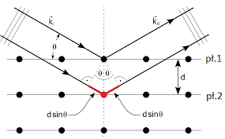
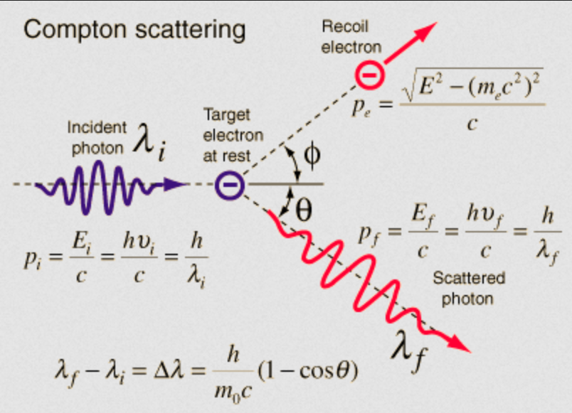

# Model drabinkowy energii (Bohra)
$$
E_n = E_1n^{-2} \\
v_n = v_1n^{-1} \\
r_n = r_1n^2

$$
## Warunek zaabsorbowania photonu
$$
E_\gamma = \Delta_i^j E_{e^-} = E_1 [\frac{1}{j^2} - \frac{1}{i^2}]
$$

# Fotokomórka
Fotokomórka działa na zasadzie zjawiska fotoelektrycznego zewnętrznego (jeśli foton padający na powierzchnię fotokomórki ma energię $E_{\gamma} \ge W_{\text{wyjścia}}$, to go wybija. **¡1 photon - 1 elektron!**). Jeśli na fotokomórkę pada światło (zdolne do wybicia elektronów), to płynie w niej prąd $\{I_0 : U = 0\}$ (gdyż część elektronów i tak dostaje się do drugiej okładki, nawet bez dodatkowego napięcia).

W fotokomórce, napięcie powinno być zgodne z kierunkiem przewodzenia, bo inaczej wybite elektrony będą wracały na stare miejsce; aż do momentu kiedy $U = U_{\text{ham}}$ kiedy to elektrony nie wychodzą i prąd nie płynie :
$$
KE_{\text{mx}e^-} = W_{\text{pol.elek}} \\
\lrArr qU = \frac{1}{2}mv_\text{max}^2
$$

# Lampa rent
Mamy 2 płytki i jebitne napięcie między nimi. Z pola elek. wiemy, że: $\Delta E_k = qU$ ($q = e^-$ - ładunek elektronu, $U$ - napięcie). Zakładamy też, że elektrony na stracie nie mają żadnej prędkości, więc:
$$
E_{k0} = \frac{1}{2}m * 0^2 = 0 \\
\Delta E_k = E_{k1} - E_{k0} = E_{k1} - 0 = E_{k1} = \frac{1}{2}mv^2
$$ 
Promieniowanie X powstaje w procesie wyhamowywania tych zapierdalających elektronów - oddają one swoją energię kinetyczną i zamieniają w 2 rzeczy:
1. Promieniowanie X - the good stuff. Niestety, jest to zazwyczaj mała część tej energii, typu $\frac{E_k}{1000}$
2. Reszta idzie w ciepło (bezużyteczne), więc lampy te potrzebują zajebistego chłodzenia (bo ¡kaboom! (insert pingwiny z Madagaskaru))

Jedyne co nas obchodzi to promieniowanie X. Oznaczmy przez $k$ pierwiastek energii przeznaczony na nie. Niech $E_\gamma$ będzie energią emitowanego fotonu.
$$
  E_\gamma = hf = h\frac{c}{\lambda} \\
  E_\gamma = \frac{1}{k}qU = \frac{hc}{\lambda} \\
  \lambda = \frac{khc}{qU}
$$
Best case scenario, cała energia kinetyczna zostanie przekazana na promieniowanie X, więc $k = 1$ i $\lambda$ będzie najmniejsza (dopuszczamy tylko $k \ge 1$ (wyobraź sobie $k \in (0; 1)$. Wtedy $\frac{1}{k} > 1$, więc przekazywalibyśmy więcej energii niż mamy... ¡¿la qué?!))
$$
 \lambda_{gr} = \frac{hc}{qU} 
$$
Czyli długość fali promieniowania X będzie ograniczona z lewej strony, strony fal krótkich

# Dyfrakcja o'X-rays
Żaby zaszło zjawisko dyfrakcji, długość fali musi być porównywalna z wielkością przeszkody ($\lambda \sim d$). Tak się składa, że $\lambda_{xray} \in [0.01; 10] \cdot 10^{-9}m$, a atomy mają ok. $d \in [0.062; 0.52] \cdot 10^{-9}m$. Promieniowanie **ugina** się na atomie pierwszej* (względnie pierwszej) i innej warstwy kryształu i potem ze sobą interferują. Zjawisko to opisuje wzór Bragga   
  
$$
\begin{aligned}
  2d\sin \theta=n\lambda & : n \in \{1,2,3, ...\}
\end{aligned}
$$
Kąt $\theta$ zwany jest kątem połysku. $d$ jest różne dla każdej powłoki (zależy jak patrzymy na warstwy: możemy przyjąć poziome, pionowe, czy też skośne np.)

# Zjawisko Comptona
Generalnie, Compton zaobserwował sobie poniższe zjawisko, przypomniało mu o zderzeniu, czyli (¡aha!) foton musi mieć pęd. Z zachowania energii mamy:
$$
E_0 = E_1 \\
\begin{aligned}
  hf + 0 = hf' + \frac{1}{2}mv^2 & : f' < f
\end{aligned}
$$
Compton wyznaczył później ten pęd (my użyjemy najsłynniejszego równania Einsteina):
$$
E = \frac{hc}{\lambda} \\
E = mc^2 \\
\frac{h}{\lambda} = mc = p \\
p = \frac{h}{\lambda}
$$

# Fale materii
Później de Broglie był zazdrosny i stwierdził, że skoro fala może mieć pęd, to materia może mieć długość fali:
$$
\lambda = \frac{h}{p} = \frac{h}{mv}
$$

# Widma
**widmo** - rozszczepione na poszczególne barwy promieniowanie.   
Rodzaje:  
1. Emisyjne - emitowane przez rozgrzany gaz.
2. Absorpcyjne - przepuszczane przez zimny gaz.
3. Ciągłe / Liniowe

## Wzór emisyjny
Niech   
$R$ będzie stałą Rydberga $R=1.097 \cdot 10^7m^{-1}$,  
$n$ numerem serii - odbitą **na** którą *"spada"*,  
$k$ numerem linii - orbitą relatywną, **z** której *"spada"* : $k = n + i | n,i \in \N$
$$
\frac{1}{\lambda} = R [\frac{1}{n^2} - \frac{1}{k^2}]
$$